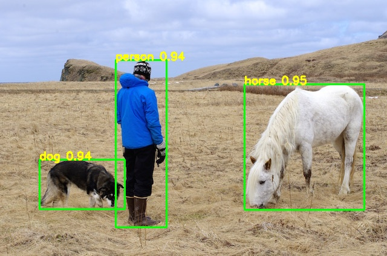
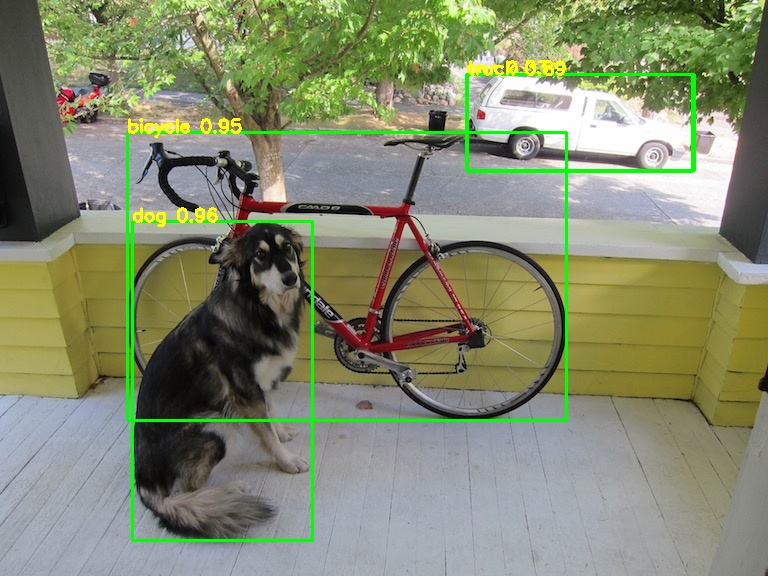
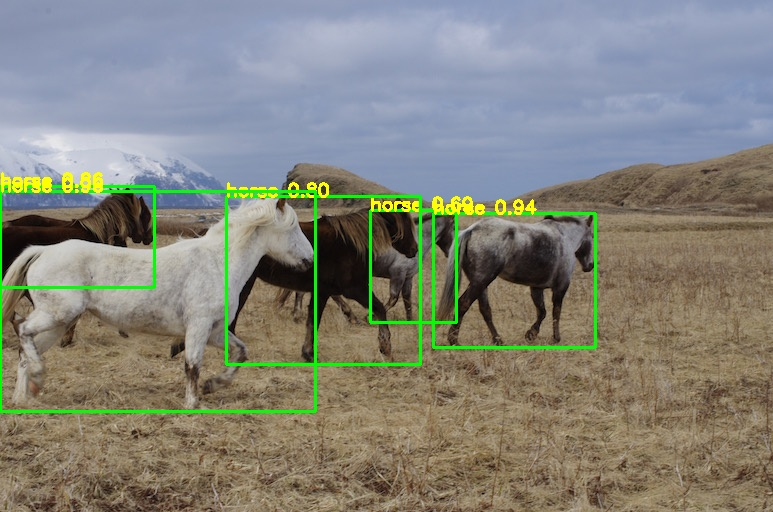
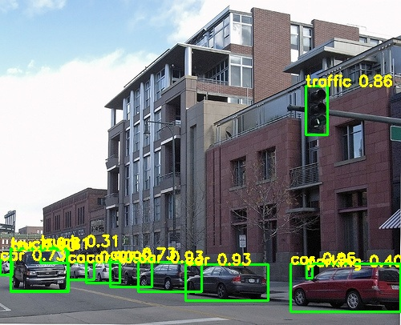

# YOLOV7_PyTorch
yolov7's classic model to pytorch

## Demo
     
   

## 中文解读
传送门

## Model
[yolov7_samylee.weights, 提取码8888](https://pan.baidu.com/s/1UYZR4QV_WaWBJBWg0lxZVw)

## Reference
https://github.com/AlexeyAB/darknet  
https://blog.csdn.net/samylee  
